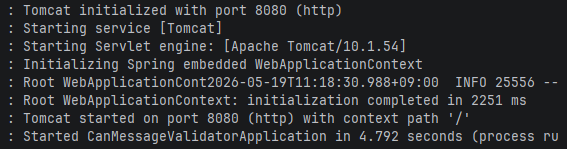
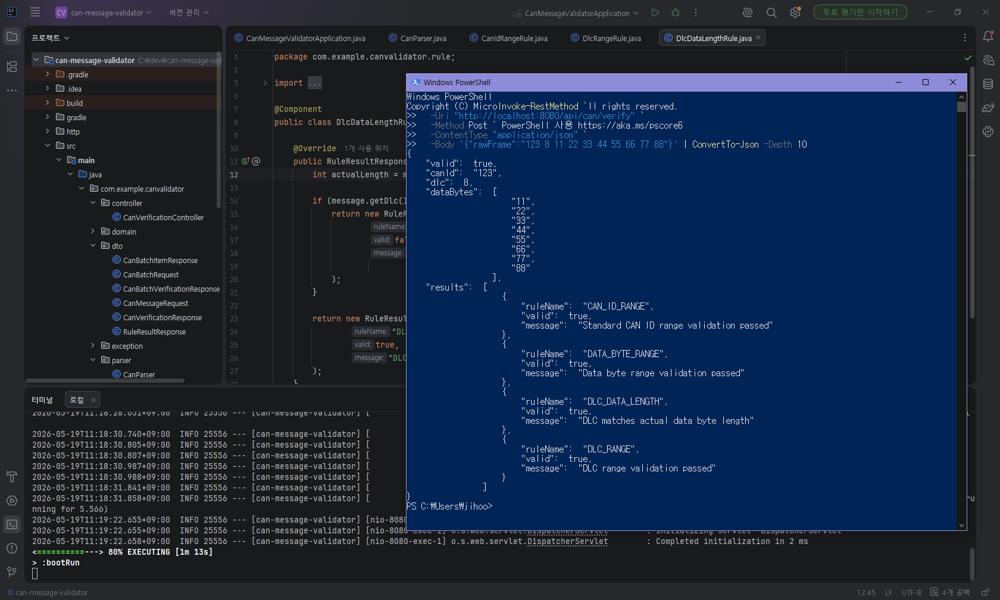
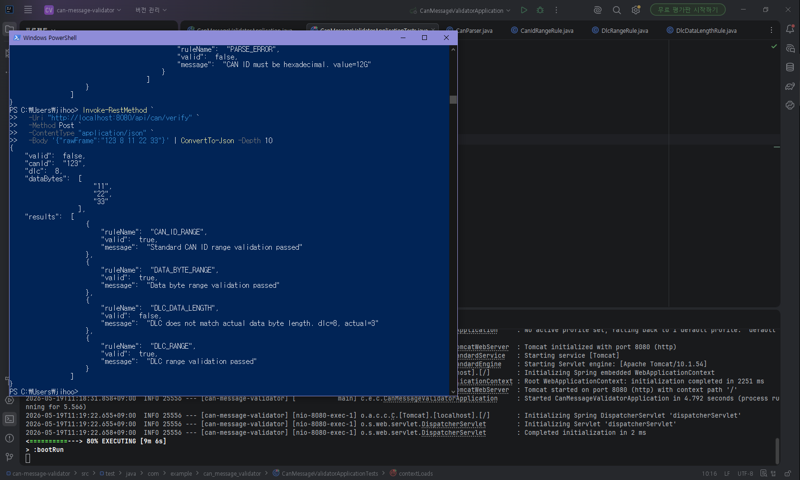
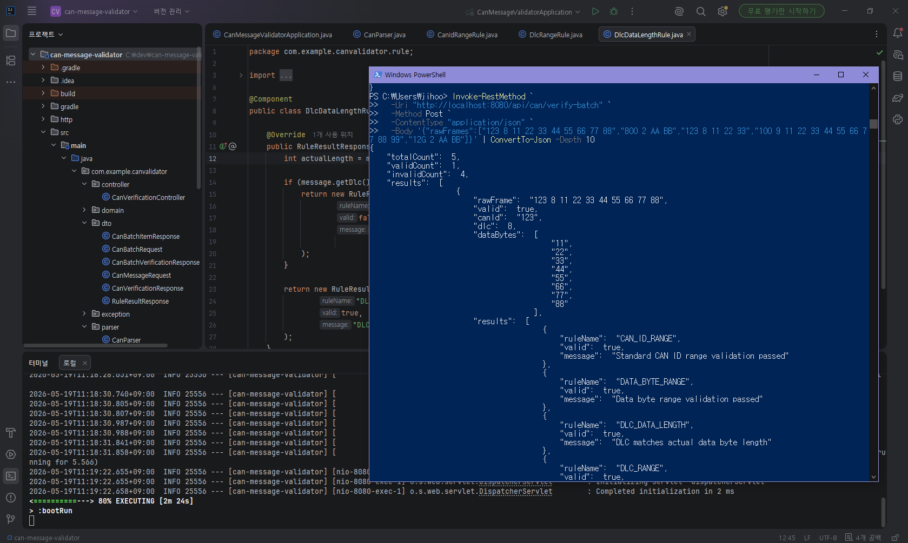

# CAN Message Validator

Spring Boot 기반 CAN 메시지 검증 미니 프로젝트입니다.

이 프로젝트는 실차 CAN 데이터를 분석한 프로젝트가 아니라, 샘플 CAN raw frame을 기반으로 CAN 메시지의 기본 구조와 검증 흐름을 이해하기 위해 구현했습니다.

CAN ID, DLC, Data Field를 파싱하고, 규칙 기반으로 정상/오류 여부와 오류 원인을 반환합니다.

---

## 1. Project Purpose

CAN 통신 구조를 학습하면서, 수집된 로그를 해석하기 전에 메시지가 올바른 형식인지 먼저 확인해야 이후 데이터 해석도 신뢰할 수 있다고 판단했습니다.

차량에서는 제어 시스템의 상태와 동작 정보가 통신 데이터로 기록되기 때문에, 메시지 구조를 이해하고 형식 오류를 구분하는 과정이 평가 결과 해석의 기초라고 생각했습니다.

---

## 2. Tech Stack

- Java 21
- Spring Boot
- Gradle
- REST API
- PowerShell API Test

---

## 3. Main Features

### Single CAN Frame Validation

하나의 CAN raw frame을 입력받아 정상/오류 여부를 검증합니다.

#### Endpoint

```http
POST /api/can/verify
```

#### Request

```json
{
  "rawFrame": "123 8 11 22 33 44 55 66 77 88"
}
```

#### Response Example

```json
{
  "valid": true,
  "canId": "123",
  "dlc": 8,
  "dataBytes": ["11", "22", "33", "44", "55", "66", "77", "88"],
  "results": [
    {
      "ruleName": "CAN_ID_RANGE",
      "valid": true,
      "message": "Standard CAN ID range validation passed"
    },
    {
      "ruleName": "DLC_RANGE",
      "valid": true,
      "message": "DLC range validation passed"
    },
    {
      "ruleName": "DLC_DATA_LENGTH",
      "valid": true,
      "message": "DLC matches actual data byte length"
    },
    {
      "ruleName": "DATA_BYTE_RANGE",
      "valid": true,
      "message": "Data byte range validation passed"
    }
  ]
}
```

---

### Batch CAN Frame Validation

여러 개의 CAN raw frame을 한 번에 입력받아 전체 메시지 수, 정상 메시지 수, 오류 메시지 수를 요약합니다.

#### Endpoint

```http
POST /api/can/verify-batch
```

#### Request

```json
{
  "rawFrames": [
    "123 8 11 22 33 44 55 66 77 88",
    "800 2 AA BB",
    "123 8 11 22 33",
    "100 9 11 22 33 44 55 66 77 88 99",
    "12G 2 AA BB"
  ]
}
```

#### Response Summary Example

```json
{
  "totalCount": 5,
  "validCount": 1,
  "invalidCount": 4
}
```

---

## 4. Validation Rules

| Rule | Description |
|---|---|
| `CAN_ID_RANGE` | 표준 CAN ID 범위 `0x000 ~ 0x7FF` 검증 |
| `DLC_RANGE` | DLC 값이 `0 ~ 8` 범위인지 검증 |
| `DLC_DATA_LENGTH` | DLC와 실제 Data Byte 개수가 일치하는지 검증 |
| `DATA_BYTE_RANGE` | 각 Data Byte가 `0x00 ~ 0xFF` 범위인지 검증 |
| `PARSE_ERROR` | CAN ID 또는 Data Byte가 16진수 형식인지 검증 |

---

## 5. Example Test Cases

| Raw Frame | Expected Result | Reason |
|---|---|---|
| `123 8 11 22 33 44 55 66 77 88` | Valid | 정상 메시지 |
| `800 2 AA BB` | Invalid | 표준 CAN ID 범위 초과 |
| `123 8 11 22 33` | Invalid | DLC와 실제 Data Byte 개수 불일치 |
| `100 9 11 22 33 44 55 66 77 88 99` | Invalid | DLC 허용 범위 초과 |
| `12G 2 AA BB` | Invalid | CAN ID 16진수 형식 오류 |

---

## 6. How to Run

```powershell
.\gradlew bootRun
```

서버 실행 후 아래 API를 호출할 수 있습니다.

```text
http://localhost:8080/api/can/verify
http://localhost:8080/api/can/verify-batch
```

---

## 7. Build

현재 테스트 패키지 정리 전이므로 빌드는 테스트를 제외하고 수행합니다.

```powershell
.\gradlew clean build -x test
```

---

## 8. Test Commands

### Single Valid Frame

```powershell
Invoke-RestMethod `
  -Uri "http://localhost:8080/api/can/verify" `
  -Method Post `
  -ContentType "application/json" `
  -Body '{"rawFrame":"123 8 11 22 33 44 55 66 77 88"}' | ConvertTo-Json -Depth 10
```

### Single Invalid Frame

```powershell
Invoke-RestMethod `
  -Uri "http://localhost:8080/api/can/verify" `
  -Method Post `
  -ContentType "application/json" `
  -Body '{"rawFrame":"123 8 11 22 33"}' | ConvertTo-Json -Depth 10
```

### Batch Validation

```powershell
Invoke-RestMethod `
  -Uri "http://localhost:8080/api/can/verify-batch" `
  -Method Post `
  -ContentType "application/json" `
  -Body '{"rawFrames":["123 8 11 22 33 44 55 66 77 88","800 2 AA BB","123 8 11 22 33","100 9 11 22 33 44 55 66 77 88 99","12G 2 AA BB"]}' | ConvertTo-Json -Depth 10
```

---

## 9. Project Structure

```text
src/main/java/com/example/canvalidator
 ├── controller
 ├── domain
 ├── dto
 ├── exception
 ├── parser
 ├── rule
 └── service
```

---

## 10. Screenshots

### Server Running



### Single Valid Result



### Single Invalid Result



### Batch Summary Result



---

## 11. Scope

이 프로젝트는 샘플 CAN raw frame을 사용한 학습용 검증 API입니다.

포함한 내용:

CAN ID, DLC, Data Field 파싱
- 기본 형식 검증
- 오류 원인 분류
- 단일 메시지 검증
- Batch 메시지 검증

포함하지 않은 내용:

- 실차 CAN 로그 분석
- CANoe, CANalyzer 연동
- DBC 기반 Signal 해석
- Alive Counter, Checksum, Timeout 검증

---

## 12. Next Step

- 샘플 CAN 로그 대량 생성
- MongoDB 기반 검증 결과 저장
- CSV 리포트 자동 생성
- DBC 기반 Signal 파싱 구조 추가
- 대량 CAN 로그 Batch 분석 자동화
